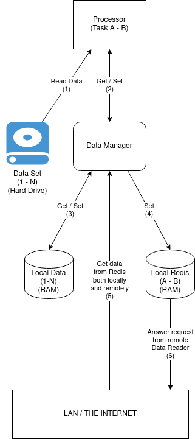

THESIS - Page Rank on Heterogeneous Clusters
=====

# Abstract
<!-- Key points -->
+ Data is increasing very quickly, and many of them are graph-based data. And also increasingly needs of getting meaningful information from it.
+ As the data grow, the size of graph data sets also increase exponentally, make it impossible to a single machine to apply even the simplest algorithm on them
+ And one way to solve that is to use multiple computers to work together on same data set to get inside, each worker will incharge of a small portion of the data set. But there is a big disadvantage about this: communication via netword are needed, and they are too slow.
+ In this paper, we propose several approach to reduce the communication data via the network, and by that, spead up the process as a whole. By applying this method on PageRank, 
+ TODO: Add comparation between the application with Spark on Page Rank with the same data set.


# Introduction

+ [Cite: PGX.D Point](../paper/PGX.D.pdf)
  + Recently, graph analysis has been drawing a lot of attention fromboth industry and academia, as a powerful method for data analy-sis.   In  graph  analysis,  the  underlying  data  set  is  represented  asa graph such that the arbitrary, fine-grained relationships betweendata entities are explicitly captured as the edges in the graph.  By following these edges, graph analysis naturally considers even theindirect, multi-hop relationships across the whole dataset.  Conse-quently, graph analysis can discover valuable, non-obvious infor-mation about the original data set.
  + However,  applying graph analysis on a very large dataset in afast and scalable manner can be challenging.  A typical large-scalegraph analysis exhibits the following characteristics:
    + The size of the graph is very large – larger than the capacityof a single machine’s main memory.
    + Many small-sized random memory accesses over the wholegraph  instance  are  performed,  especially  during  neighbor-hood iterations and graph traversals.
    + The  computation-to-communication  ratio  is  low  –  i.e.,  theamount of computation is small compared to the amount ofdata movement.
    + There is a large degree of inherent parallelism
+ The same characteristics are also correct with page rank. TODO: Greater detail about its with detail number  (eg: 99% spend on communication related work)
  + TODO: Some special characteristic like increase task will reduce time on each round.
+ TODO: Deeper comparation between the application with Spark

<!-- Write down method that use in the application here, and also general number how much faster -->
<!-- Consider to move some points to method instead of introduction -->
1. Load all the nodes weight at the beginning
   1. TODO: Compare with bulk request
   2. TODO: Compare with Ghost Nodes 
   3. TODO: Why this is doable for page rank
      1. How about other algorithm.
2. Load balancing
   1. Algo behind it
   2. Greatly depend on the algorithm ( ratio of computing time / communicating time )
   3. Preload extra data
      1. Good: reduce data has to be sent significantly
      2. Bad: Can only regulate to the better state, cannot go to optimal point if the task distributed too unbalance at first.

# The Application: <!-- Explain the process flow in detail, with example -->

## Overall Structure, Connection

+ 

## Connection in detail



<!-- TODO: Simplify following explanation -->
+ Connection (1): Between `Processor` and `Data Reader`
  + GET: `Data Reader` answers request from processor about requested data. `Processor` will ask question like: What is the value of ```nodesList = [1, 4, 400, 123104, 6021998, 20041998]``` after ```round = 15```. Processor will not care if all the nodes are from the same workers, or in different workers.
  + SET: `Processor` will request sth like: Set the value of  ```nodesList = [15, 16, 17, 1001, 1002, 1003]``` with ```values = [0.5, 0.456, 0.789, 0.568, 0.154, 2.465]```. It guarantees that all node in `nodesList` is belong to the current worker.

+ Connection (2):  Between `Data Reader` and `Local Cache`
  + GET: `Data Reader` request the `Local Cache` to answer question like: What is the value of ```nodesList = [1, 4, 400, 123104, 6021998, 20041998]``` after ```round = 15```. It is exactly the same with the question `Processor` asks `Data Reader` before. Node that it cannot be sure that `The Cache` has all the needed data. So the answer would be sth like: ```values = [0.5, -1, -1, 0.154, 2.465, -1]``` with -1 mean the `Local Cache` does not have needed value.
  + SET: Add data to the `Local Cache`. If the number of records inside the `Local Cache` becomes greater than a threshold, it will remove some oldest records. SET will be called after `Data Reader` get new data from `Local Redis` of current worker, or `Local Redis` from other workers

+ Connection (3 + 4): Between `Data Reader` and `Local Redis`
  + GET: `Data Reader` request the `Local Redis` to answer question like: What is the value of ```nodesList = [1, 4, 400, 123104, 6021998, 20041998]``` after ```round = 15```. It is exactly the same with GET request from (2), but expected to receive all the answer.
  + SET: `Data Reader` will request the `Local Redis` sth like: Set the value of  ```nodesList = [15, 16, 17, 1001, 1002, 1003]``` with ```values = [0.5, 0.456, 0.789, 0.568, 0.154, 2.465]```. It is same as SET in (1). It is guarantee that `Data Reader` will never request SET for other workers' `Local Redis`

+ Connection (5): It's the same as GET in (4). The only different is that it answers the request from `Data Reader` of other workers

## Flow

+ Flow of a worker that initially assigned nodes from A to B
  + Step 1: Load the initially  assigned data + buffer data from Hard Drive.
    + Assigned Data: From A to B    
    + Buffer Data: From A - (B-A)/2 to A, and B+ (B-A)/2
    + From (i+ii), the worker will load from node A - (B-A)/2 to B+ (B-A)/2
  + Step 2: Get all nodes’ weight from the last round. 
  + Step 3: Get the assigned node for the coming round. It is guaranteed that all the nodes are from A - (B-A)/2 to B+ (B-A)/2
  + Step 4: Calculate the new weight if assigned nodes of this round
  + Step 5: Load the calculated result to local Redis for other workers to read in step 2 of next round
  + Step 6: Go back to step 2 if not the final round. Otherwise end the program.
+ How to re-distribute task between round, example with a worker that initially assigned nodes from A to B
  + The worker already loaded data from node A - (B-A)/2 to B+ (B-A)/2. 
  + At the beginning of each round, the worker will receive the task for that round represented by 2 numbers A’ and B’. This means for this round the worker will calculate the weight of nodes from  A’ to B’.
  + It is guaranteed that A - (B-A)/2 <= A’ < B’ <= B+ (B-A)/2. 
    + By this, the worker does not need to read any new data from Hard Drive or have to ask other workers.  => re-distribute tasks is very easy and fast. (Good)
    + But this also means that it cannot go beyond A - (B-A)/2 and B+ (B-A)/2, thus reducing the flexibility of the system. (Bad)

# Method to reduce network data <!-- Deeper info about each method. Check the method in Introduction -->

## Method 1

## Method 2

## Method 3

# Result
<!-- Compare with existing framework -->
<!-- Compare the application with and without each method -->

# Discussion
<!-- ???  -->

# Conclusion
<!-- ???  -->

# Related Work
<!-- ???  -->

# References
<!-- ???  -->

# NOTE

+ Writing Style: https://www.cs.columbia.edu/~hgs/etc/writing-style.html
+ How to write a paper: https://onlinelibrary.wiley.com/doi/epdf/10.1002/adma.200400767
+ How to read a paper: [link](../paper/HowtoReadPaper.pdf)