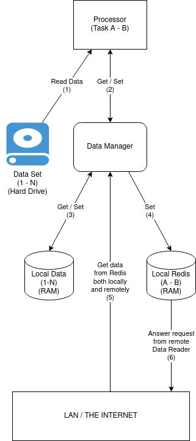

THESIS - Page Rank on Heterogeneous Clusters
=====

# Abstract

+ TODO: Add comparation between the application with Spark on Page Rank with the same data set.

In recent years, it is not hard to notice that with the development of big data, we have actively accumulated a tremedous amount of data. In 2020, this number is about 64 zettabytes, and 2021 estimate to be 79 zettabytes[1]. As a result, number of data set, the size of the data set, and also the need to extract important insides from the data have been increased significantly. And among these, many are graph related: friends connections, website links, etc. As the size of the data set increased dramatically, it is now almost imporsible for any single machine to handle a big data set with a reasonable amount of times, and most of the time is not even for processing, but to load the data in and out of the ram.

To deal with this problem with low cost, a commonly used method is that using multiple machines with different spec, each will load / process only part of the data set and in constance communication. Depend on the computing power, each computer will be assigned bigger or smaller task(Heterogeneous Clusters). However, this approce faces 2 big problems: The first one is Network-overheated: too many data has to be sent via the network will low speed and high latency. And the second one is Load balancing: a bad load balancing between machines in a cluster will lead to some machines have to wait for others to finish. Both these problems have significant negative impact on running time as a whole.

In this paper, we propose 2 methods to solve these above problems: The first one is to deal with sending large amount off data via a network with limited speed and high latency. And the second one is a method for load balancing between machines with very little communication data need to be sent. Both methods forcus on reducing impact of sending data via the network, and thus improve the running times. By apply these 2 methods to page rank running on a cluster of 2-3 machines with completely different spec, we confirmed that they can help to speedup [TODO: add number] compare with [TODO: do more experiment]

[1]: https://www.statista.com/statistics/871513/worldwide-data-created/

# Introduction

Getting insides from a big graph related data set can be challenging. An typical large graph data set will have 4 following characteristics[2]:
  1. The side of the data set is very big, bigger than the ram capacity of a single machine, make it impractical to process the data using only one machine
  2. Ram accesses are also very ramdom and umpredictable, make it imposible to know which part of the data set should be loaded in advance. This make pre-loading a segmant of the data set only be impossible.
  3. The ratio between work load computation and communication is extremly small, leading to it is more practical to improve communication strategy rather than impove the computation process.
  4. There is very large degree of inherent parallelism. With the right setup, thousand of independence machines can easily process the same data set without any conflict.

As the result of these above characteristics, one common approche is to use a cluster of machine to work together on the same data set. Many famous frameworks are using this approach such as GraphLab, or GraphX, but the performance is disapoting ([From: PGX.D, but will need actual data from experiment](../paper/PGX.D.pdf)). Another framework is PGX.D included with many technique to reduce data sent via network, claims that they can out perform a single machine with enough RAM with a cluster from 2-16 computers. But this result was built on top of a very expensive network systems with high bradwith (56Gb/s) and ultra low latancy(1us), which is not something everyone can affort, make the penalty of sending data via network significanly lower than normal setup.

In this paper, we present 2 simple methods that can significantly reduce the network traffict being sent during the process, and by applying them to page rank algorithm on a cluster of 2-3 machines, we can experiment how effective they are.

In section one, we will explain how do we implement the application in detail.
[TODO: add more section] 

Our contribution can be summarized as follow:

1. A simple application to run pagerank that can be change to execuate other algorithm as well. [TODO: explain a bit more]
2. Low data-overheated commnunication method [TODO: explain a bit more]
3. Low data-overheated auto balancing method [TODO: explain a bit more]

[2]: [From: PGX.D](../paper/PGX.D.pdf)

# The application

## Overview

The application is a distributed in-memory graph processing where a large graph is divided over multiple machine memory in a cluster

As many different graph processing framework, we also divide the process into multiple rounds. Each round will calculate depend on the result of the last round. The task in each round will be divided again into multiple smaller parts for multiple machines beling to the cluster. In this application we use we use Bulk Synchronous Parallel(BSP), which is each worker will have to wait other worker to finish the same round before continue to the next round. This approach will result in lower error but at the cost of higher running time (compare with Asynchronous Parallel)

In each round, the task will be again divided into multiple smaller part that can run in parallel by multiple machines in the cluster. The following image show a cluster of 4 machines, each will only incharge of processing a portion of the task for a round.

+ 

In here, we havea cluster of 4 machines to process a graph consis of N nodes. In a round, the first machine will in charge of calculating the result of nodes 1 to A, the second is from A+1 to B, and so on. Note that for each round, the value of A, B, C will be modified for better load balanncing. 

## Detail in each machine

+ 

### TODO: expain about data for each node (value + structure)

### Processor

In charge of calculation the result for each node. Get the data from data data manager. The implementation of processor is quite straigh forward since from its point of view, where is the data and how to get it is not important as the data manager will take care for all of that.

### Data Manager

As for most of the graph algorithm when running on a cluster, most of the work is communication related insteading processing. So the data manger is the most important part in the application, where all of the data read / write occur.

Data manager has 3 mains task:

1. Answer request from processor about the value of nodes. To do this, data manager can always ask Local Data for the value. 
2. Update calculated result of nodes A to B from processor to both Local Data, and Local Redis
3. Get calculated result of nodes other than from A to B from other machines, and update it to Local Data

### Local Data

Simply contain all the values of all the nodes from last round
### Local Redis

Local Redis have only one task is to answer request from Data Manager of other machines in the cluster.

### Initial Load Balancing

Can be modify depend on the setup and algorithm. Will be more in depth in section ...