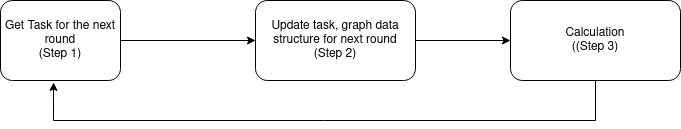

## 1. Abstract

+ TODO: Add comparison between the application with Spark on Page Rank with the same data set.

In recent years, it is not hard to notice that with the development of big data, we have actively accumulated a tremendous amount of data. In 2020, this number is about 64 zettabytes, and 2021 estimate to be 79 zettabytes[1]. As a result, number of data set, the size of the data set, and also the need to extract important insides from the data have been increased significantly. And among these, many are graph related: friends connections, website links, etc. As the size of the data set increased dramatically, it is now almost impossible for any single machine to handle a big data set with a reasonable amount of times, and most of the time is not even for processing, but to load the data in and out of the ram.

A common approach for over size data set is to use multiple machines to form a cluster to work on the same problem and data set. In side the cluster, depend on the compute power of the machine, each will receive a small part of the problems. But this approach have a problem: network overheated. As each machine only contains part of the data set, they have to constantly asking for data from other machines, and thus lead to the problem.

So to resolve this problem, in this paper, we propose 2 simple methods aim to reduce the column of communication data between machines, and thus lead to better performance of the application.

[1]: https://www.statista.com/statistics/871513/worldwide-data-created/

## 2. Introduction

Recently, as it is become much easier and cheaper to gather a large amount of data with a high precision, the need to extract insight from them also getting bigger. Graph data is also not an exception. In graph analysis, the data can be present as a graph with nodes present the object, and edges present the connection, or relationship between objects. Some example for this type of data is Facebook Friends where each account is a node, and each of the friend connection is and edge. As Facebook has almost 3 billions active user, with each has in average 340 friends, this data set can has 3 billions nodes with more than 1000 billions edges. By applying various algorithm to the data set, we can extract many valuable insight that is not obvious at first.

However, applying these algorithms to a big graph data set with high efficiency can be challenging. A typical large graph data set will have 4 following characteristics[2]:
  1. The size of the data set is bigger than the ram capacity of a single machine, making it impractical to process the data using only one machine
  2. Ram accesses are also very random and unpredictable, making it impossible to pre-load the data into ram beforehand.
  3. The ratio between workload computation and communication is small, leading to most of the time is for communicating between machines instead of processing the data.
  4. There is a large degree of inherent parallelism. It is possible to set up thousand of independent computers run together on the same data set without conflict. 

It is worth pointing out that the second and the third characteristics are very different from classic computing applications that normally computing dominated and much easier to predict ram access. It is a fact that in most frameworks, the application spends more time communicating than actually doing the computation.

And to make the problem worse, balancedly distributing tasks to all computers with very different specs has been proved to be very challenging as sometimes even a smaller computer outperforms the bigger one with a specific algorithm and data set. [3]

+ 

[TODO: Add explanation about the image]

In this paper, our main contributions are:

  1. A method base on PGX.D's ghost node that can reduce the communication volume by merging them in to much bigger requests.  
  2. A method for load balancing with minimal communication needed. 

[TODO: Number instead of `SIGNIFICANTLY`]

## 3. The Problem

As we mentioned above, it is impossible for a machine to handle a big data set alone. But it is doable by using multiple machines to form a cluster, each will only have to calculate the value for a portion of nodes. For a machine, in stead of loading the whole data set, it only needs to load part of the data, enough to finish its own task. In the case of Page Rank, a machine with a nodes list `S` will need to load all the edges have node `s` belong to `S` as the destination. Or [TODO: add pseudo code to explain clearer]

Note that in this way, an edge will be loaded twice by 2 different machines if each of its nodes is not belong to the same machine. Thus, the total loaded data in the cluster always bigger than the size of the data set. 

Another characteristic of graph processing is that: many graph algorithms like Page Rank, we can divide the process into multiple rounds that each depend on the computing result of the last one. To be clear, we use the result of round i-th to calculate the result of round i+1, then using the result of round i+1 to calculate round i+2, and so on. The goal of each round is to calculate a value for all the nodes follow a pre-defined formula. In the case of Page Rank, this value is nodes' weight, and the formula is: [TODO: Add the formula here]

So for a round based algorithm, a machine in the cluster will need to kind of data to finish its task in each round:
  1. Graph structure that related to its nodes set `S`. The size of this data is very big. [TODO: add estimate compare with the size of data set]. But it will never change though the running process.
  2. Result of nodes that connected to all nodes `s` belong to `S` from last round. This data has much smaller in side, but constantly changes after each round. So it is necessary for a machine to update this data after finished every round.

A general processing step for a round based algorithm running on clusters will like below:

+ 

There are 2 point to note about above process:
  1. Step 2 is optional, it only needed if the system applies dynamic load balancing: update task for all machines after each round aim to get better load balancing. As we mentioned above, graph data is heavy, so transfer graph data between machines will take a lot of time depend on how unbalance the last round is.
  2. The last round value of node get updated only when the value is referred to. For example, if the node `n` not in the machine `m`, then `n`'s value only get updated when an node belong to `m` needed its value. This will result in all the machines in cluster send too much small request ask for the value of a single node. Thus, lead to network overload. 

## 4. Ideas and system design

### 4.1 Dynamic Load Balancing with limited communication

### 4.2 Complete Nodes Copy

### 4.2 System Overview

+ 

There are some important point in our system is that:

1. Instead of randomly distribute nodes to machine as usual [TODO: np hard problem to do better], we assign nodes to a machine by 2 number `A` and `B` means that machine's task is calculate value for all the node from `A` to `B`. The value of `A` and `B` can be updated depend on the running time of last round.

#### 4.2.1 Flow

+ 

Flow of a worker that initially assigned nodes from A to B
1. Step 1: Load graph structure data for the initially assigned node, and also buffer data from Hard Drive.
   1. Assigned Data: From A to B    
   2. Buffer Data: From `A-(B-A)/2` to `A`, and `B` to `B+(B-A)/2`
   3. So the worker will load graph structure from node `A -(B-A)/2` to `B+(B-A)/2`
2. Step 2: Get all nodes’ weight from the last round. 
3. Step 3: Get the assigned node for the coming round. It is guaranteed that all the nodes are from `A - (B-A)/2` to `B+ (B-A)/2` so that no new graph data need to update.
4. Step 4: Calculate the new weight if assigned nodes of this round
5. Step 5: Load the calculated result to local Redis for other workers to read in step 2 of next round
6. Step 6: Go back to step 2 if not the final round. Otherwise end the program.

How to re-distribute task between round, example with a worker that initially assigned nodes from A to B
1. The worker already has graph structure data from node `A - (B-A)/2` to `B+ (B-A)/2`. 
2. At the beginning of each round, the worker will receive the task for that round represented by 2 numbers `A’` and `B’`. This means for this round the worker will calculate the weight of nodes from  `A’` to `B’`. It is guaranteed that `A - (B-A)/2` <= `A’` < `B’` <= `B+ (B-A)/2`. 
3. By this, the worker does not need to read any new data from Hard Drive or have to ask other workers.  => re-distribute tasks is very easy and fast.
4. But this also means that it cannot go beyond A - (B-A)/2 and B+ (B-A)/2, thus reducing the flexibility of the system.
