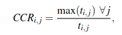
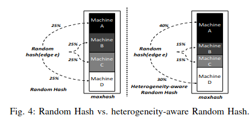
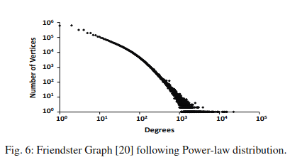
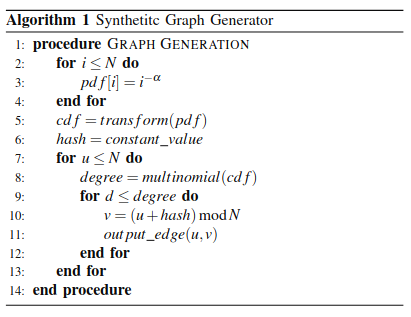

+ Able to run PAGE_RANK_WITH_REDIS with OpenMP. But the result is even worse than without
  + With OpenMP - 12 threads:
    ```
        At Sun Jun 20 15:58:00 2021
            Done Reading
        At Sun Jun 20 15:58:59 2021
            Done round 1
        At Sun Jun 20 15:59:56 2021
            Done round 2
        At Sun Jun 20 16:01:33 2021
            Done round 3
        At Sun Jun 20 16:03:12 2021
            Done round 4
        At Sun Jun 20 16:04:52 2021
            Done round 5

        real    7m23.574s
        user    16m4.615s
        sys     0m19.547s
    ```
    + Without OpenMP
    ```
        At Sun Jun 20 16:05:57 2021
            Done Reading
        At Sun Jun 20 16:06:44 2021
            Done round 1
        At Sun Jun 20 16:07:26 2021
            Done round 2
        At Sun Jun 20 16:08:47 2021
            Done round 3
        At Sun Jun 20 16:10:05 2021
            Done round 4
        At Sun Jun 20 16:11:25 2021
            Done round 5

        real    5m58.402s
        user    5m35.834s
        sys     0m7.649s
    ```
  + The main reason is because there is critical path in code that cannot run concurrently
    ```C++
        void calculation(long long round) {
            int lastRound = round - 1;
            for0(i, N) {
                double weight = 0;
                long long* nodesId = new long long[edgesTo[i].size()];
                for0(j, edgesTo[i].size()) {
                    nodesId[j] = edgesTo[i][j];
                }
                // CRITICAL START.
                // Talking with redis, cache here.


                double* values = getNodesVal(nodesId, edgesTo[i].size(), lastRound);


                // CRITICAL END
                free(nodesId);
                for0(j, edgesTo[i].size()) {
                    const int fromNode = edgesTo[i][j];
                    weight += values[j] / toNodesCount[fromNode];
                }
                free(values);
                setNodeVal(i, weight, round);
            }
        }
    ```
  + Theoritically, this should not be a critical path, and should be able to paralize. But current code return core dump all the times. (Not yet able to debug)
    + => Comeback with OpenMP later when have time. 

## Reading paper about `Proxy-Guided Load Balancing of Graph Processing Workloads on Heterogeneous Clusters` 

+ Paper [Proxy-Guided Load Balancing of Graph Processing Workloads on Heterogeneous Clusters](../paper/ICPP2016_LoadBalancing%20(1).pdf)
+ Paper summary:
  + 1.5 times faster on Heterogeneous Clusters with 25% less energy
  + Heterogeneous degree calculation:
    + 
  + There is 3 main algo for graph cutting using vertex cuts (Cannot find edges cuts in this paper) with thier modification for Heterogeneous Clusters
    + `Random`: Hash -> assign to worker by generated hash (purely random)
      + 
    + `Oblivious`: The Oblivious parti-tioning algorithm is designed to enhance data locality bypartitioning based on the history of edge assignments.
    + `Grid`: The Grid method is designed to limit the communication overheads by constraining the number of candidate machines for each assignmen
  + Graph Characteristic:
    + 
    + 

## Next work

+ Clean source code as it is too messy to maintain now
+ Find more paper to read about graph processing to gain insight.