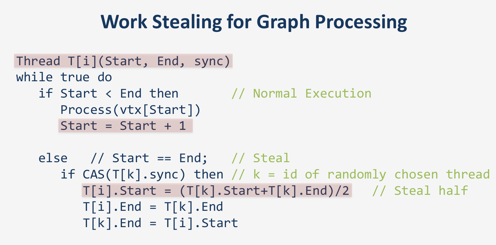

# Running Time

## 1 Worker running alone

+ REDIS
  + SET CMD RUNNING TIME: 27368.3 ms
    + COUNT: 600000
    + AVERAGE SET CMD: 0.0456138 ms
  + GET CMD RUNNING TIME: 1105.5 ms
    + COUNT: 6725
    + AVERAGE GET CMD: 0.164386 ms
+ Time In General: RUNNING TIME: 6m14s (Normally around 5m30s - 5m50s)
  + CONVERT TIME: 66.8823 ms
  + TOTAL LOAD DATA FROM REDIS TIME (both local and lan): 2412.73 ms
  + TOTAL READ TIME: 216350 ms
    + CACHE TIME: 214152 ms 214s
    + REDIS READ TIME: 1337.6 ms
  + TOTAL LOAD DATA TO REDIS TIME (local): 10118.3 ms
  + FREE RUNNING CMD: 54.5074 ms

## 2 workers (1 Desktop, 1 Laptop) each worker 50000 nodes

+ REDIS
  + SET CMD RUNNING TIME: 15296.6 ms
    + COUNT: 350000 (Should be 300000 only)
    + AVERAGE SET CMD: 0.0437045 ms
  + GET CMD RUNNING TIME: 13810.5 ms
    + COUNT: 13450
    + AVERAGE GET CMD: 1.05799 ms
+ Time In General: RUNNING TIME: 3m23s
  + CONVERT TIME: 105.039 ms
  + TOTAL LOAD DATA FROM REDIS TIME (both local and lan): 1161.64 ms
  + TOTAL READ TIME: 123010 ms
    + CACHE TIME: 107336 ms
    + REDIS READ TIME: 14595.9 ms (20 times slower)
  + TOTAL LOAD DATA TO REDIS TIME (local): 5099.1 ms
  + FREE RUNNING CMD: 22.5735 ms

## No Cache

```
SET CMD RUNNING TIME: 21424.1
GET CMD RUNNING TIME: 367752
CONVERT TIME: 36025.1

AVERAGE GET CMD: 0.735505
AVERAGE SET CMD: 0.0357068

TOTAL LOAD DATA FROM REDIS TIME (both local and lan): 19455.1
TOTAL READ TIME: 500421
TOTAL LOAD DATA TO REDIS TIME (local): 10248.5
FREE RUNNING CMD: 46.3709

11m30s
```

### Conclusion
+ Can improve cache by using a different algorithm that support bulk search.
+ Using pre-assigned memory instead of using `malloc`

# Paper

+ Some ideas:
  + Work stealing
    + 
  + Communication-Aware Load Balancing
    + Each worker have to communicate the same amount of time with other workers (Inner communication cost consider as 0)
  + Distributed Edge Migration
    + Sharing workload by sending edges instead of nodes
+ It seems like approaches using purely algorithm bring very limited result. Most of papers start to consider using hardware specified for graph processing. And then from specialized computer, using a specialized algorithm that only effect on that structure.
  + Bringing ram closer to cpu
  + Using Field Programmable Gate Arrays (FPGAs) ???
  + Modifying ram structure

# Next step

+ reduce communication with other worker redis using better caching