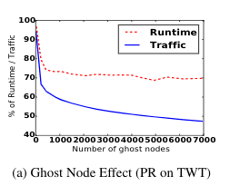

## Ghost node

+ Selective ghost node creation is a technique to choose a set of high-degree vertices and to duplicate ghost copies of them on each machine
+ Created at loading time
+ 

## Idea for caching

### Support Bulk Insert / Get

+ Using `linked list` with the travel idea from `LCA - Last Common Ancestor`
+ Structure for each element in linked list:
  + `element_id` (int): the data with both `node_id` and `current_round`. For example, `current_round` is 3 and `node_id` 12345 then element_id = 3 * 10e12 + 12345
    + element_id must guarantee that next element in list will have bigger element_id
      + [element_id: 300123] -> [element_id: 300124] -> [element_id: 300331] -> [element_id: 400001]
    + Element from later round will has bigger element_id
    + Element from same round but bigger node_id will also has bigger element_id
  + value (double): Value of node at the round encoded in `element_id`
  + next_elements (list of *element, max size 64): Contain the pointer of next elements in list
    + next_elements[i] contain the 2^i-th next element in the list
      + next_elements[0] of element[1] is element[2]
      + next_elements[1] of element[1] is element[3]
      + next_elements[2] of element[1] is element[5]
      + ...
      + next_elements[10] of element[1] is element[1025]
  + last_elements (list of *element, max size 64): Same with next_elements but for last elements
    + last_elements[10] of element[1025] is element[1]

+ `Bulk Get` actions:
  + For example we have a `linked list` A
  
    ```javascript
    A = [ 
        {element_id: 300123, value: 1}, {element_id: 300124, value: 1}, {element_id: 300125, value: 1},
        {element_id: 300143, value: 1}, {element_id: 300153, value: 1}, {element_id: 300163, value: 1},
        {element_id: 300233, value: 1}, {element_id: 300343, value: 1}, {element_id: 300453, value: 1},
    ]
    ```
  + If we want to get the value of [300125, 300153, 300453]. After found 300125, we do not have to start again to looking for 300153 but we can continue to search from 300125 instead. This will save a little bit of travel times. The bigger the size of get list, the faster it run to find 1 element.

+ This also support multiple threads as each pointer will not change its value even when multiple thread are updating new value