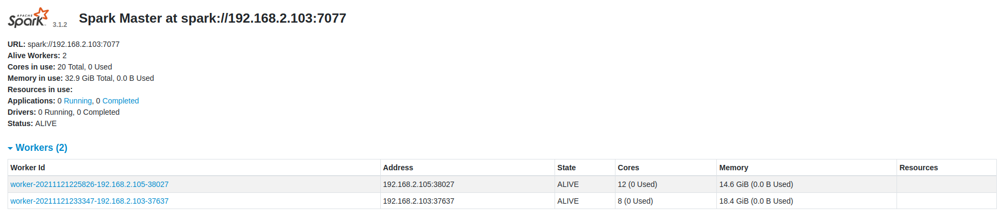

# Multiple thread while calculating

1. Result on Laptop + Desktop (9.5M nodes, 300M edges)
   + 1 machine: 20s / round -> 6.6s / round (8 cores) 
   + 2 machines: 14s / round -> 8.1s / round (8 cores + 12 cores)
1. Resut on Raspberry Pi 4
   + 1 machine: 23s / round
   + 2 machines: 10.5s / round ( NOTE: < 23 / 2)
   + 4 machines: 6s / round
   + 7 machines: 4.9 / round  
   
# SparkX

1. Able to setup the cluster consis of 2 machines:
   + 
1. Running pagerank example from graphX, but not yet using compute power of 2 workers (Unknown reason, continue to test)

# Next

1. Run page rank with same data set using graphX (code use pyspark)
1. Compare and finish `result` section
1. Prepare graphs, illustrations
