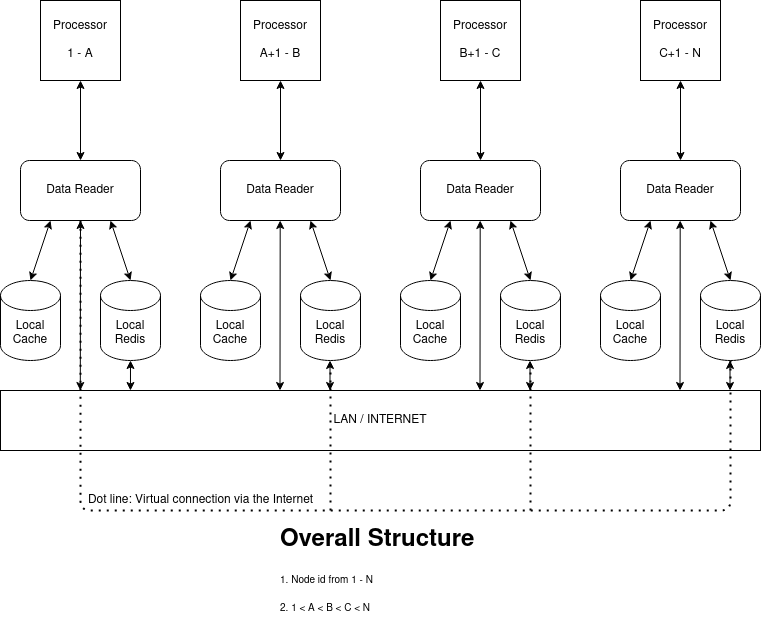
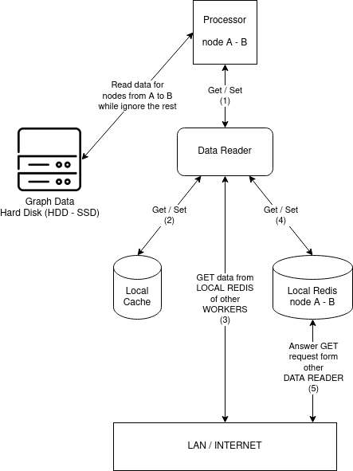

## Overall Structure, Connection

+ 

## Connection in detail



+ Connection (1): Between `Processor` and `Data Reader`
  + GET: `Data Reader` answers request from processor about requested data. `Processor` will ask question like: What is the value of ```nodesList = [1, 4, 400, 123104, 6021998, 20041998]``` after ```round = 15```. Processor will not care if all the nodes are from the same workers, or in different workers.
  + SET: `Processor` will request sth like: Set the value of  ```nodesList = [15, 16, 17, 1001, 1002, 1003]``` with ```values = [0.5, 0.456, 0.789, 0.568, 0.154, 2.465]```. It guarantees that all node in `nodesList` is belong to the current worker.

+ Connection (2):  Between `Data Reader` and `Local Cache`
  + GET: `Data Reader` request the `Local Cache` to answer question like: What is the value of ```nodesList = [1, 4, 400, 123104, 6021998, 20041998]``` after ```round = 15```. It is exactly the same with the question `Processor` asks `Data Reader` before. Node that it cannot be sure that `The Cache` has all the needed data. So the answer would be sth like: ```values = [0.5, -1, -1, 0.154, 2.465, -1]``` with -1 mean the `Local Cache` does not have needed value.
  + SET: Add data to the `Local Cache`. If the number of records inside the `Local Cache` becomes greater than a threshold, it will remove some oldest records. SET will be called after `Data Reader` get new data from `Local Redis` of current worker, or `Local Redis` from other workers

+ Connection (3 + 4): Between `Data Reader` and `Local Redis`
  + GET: `Data Reader` request the `Local Redis` to answer question like: What is the value of ```nodesList = [1, 4, 400, 123104, 6021998, 20041998]``` after ```round = 15```. It is exactly the same with GET request from (2), but expected to receive all the answer.
  + SET: `Data Reader` will request the `Local Redis` sth like: Set the value of  ```nodesList = [15, 16, 17, 1001, 1002, 1003]``` with ```values = [0.5, 0.456, 0.789, 0.568, 0.154, 2.465]```. It is same as SET in (1). It is guarantee that `Data Reader` will never request SET for other workers' `Local Redis`

+ Connection (5): It's the same as GET in (4). The only different is that it answers the request from `Data Reader` of other workers
